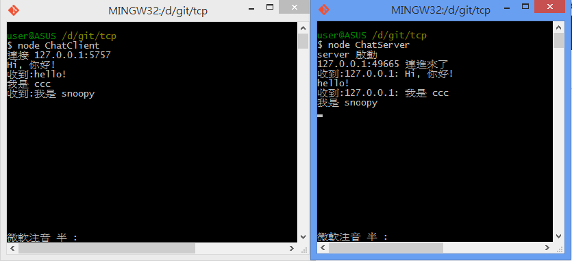

# 一對一聊天 （命令列介面）

## 執行畫面



## server 端

檔案: ChatServer.js

```javascript
var net = require('net');
var readline = require('readline').createInterface(process.stdin, process.stdout);

var server = net.createServer();

server.on('connection', function(sock) {
  console.log(sock.remoteAddress +':'+ sock.remotePort+' 連進來了');

  readline.setPrompt('');
  readline.prompt();

  readline.on('line', function(line) {
    sock.write(line);
    readline.prompt();
  });
  
  sock.on('data', function(data) {
    console.log('收到:' + sock.remoteAddress + ': ' + data);
  });
});

server.listen(5757);
console.log('server 啟動');

```

## client 端

檔案: ChatClient.js

```javascript
var net = require('net');
var readline = require('readline').createInterface(process.stdin, process.stdout);

var client = new net.Socket();

readline.on('line', function(line) {
  client.write(line);
  readline.prompt();
});
  
client.connect(5757, '127.0.0.1', function() {
  console.log('連接 ' + client.remoteAddress + ':' + client.remotePort);
  readline.setPrompt('');
  readline.prompt();
});

client.on('data', function(data) {
    console.log('收到:' + data);
});
```